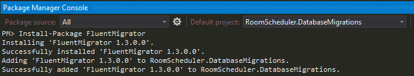
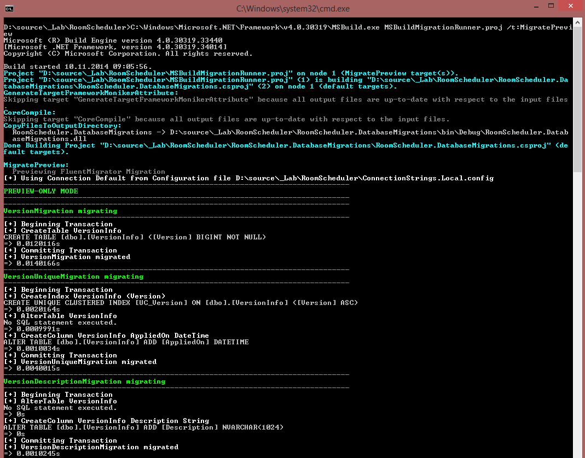

## Database Development Guidance - Schema Creation, Migration, Automation, Versioning 

TODO:
http://www.informatica.com/se/Images/02241_data-migration-baseline-deployment_ips_en-US.pdf
https://github.com/schambers/fluentmigrator/wiki/Enforce-migration-version-numbering-rules

I had several goals in mind before choosing FluentMigrator as the primary database migration tool. So here they are:

- New developers in project should be able to build the entire database in their local system with a single click
- Altering the database schema should be versioned 
- Version tracking of the underlying database
- Upgrading and migrating the database should be done automatically
- Schema creation should be database provider agnostic - same schema should be able to be deployed to MSSQL, PostgreSql and MYSQL

### Database development process overtime sketches

## Step by step guide

### 1. Create New Class Library Project

 

### 2. Install-Package FluentMigrator

 

### 3. Create new folder "Migrations" to project - here we gonna store migration files
 
### 4. Create new class "Baseline.cs" - the life of the database starts from this class

For demonstration purpose we are going to build database schema for basic RoomScheduler system.
The baseline script will contain all initial tables and columns that our system needs. So, I am going to create 2 tables - Room and Person. 

		using System;
		using FluentMigrator;
		
		namespace RoomScheduler.DatabaseMigrations.Migrations
		{
		    [Migration(0)]
		    public class Baseline : Migration
		    {
		        /// 

		        /// Executes when upgrading the database to higher version
		        /// 

		        public override void Up()
		        {
		            Create.Table("Room")
		                .WithColumn("Id").AsInt32().NotNullable().PrimaryKey()
		                .WithColumn("DateCreated").AsDateTime().NotNullable()
		                .WithColumn("Name").AsString(50).NotNullable();
		
		            Create.Table("Person")
		                .WithColumn("Id").AsInt32().NotNullable().PrimaryKey()
		                .WithColumn("DateCreated").AsDateTime().NotNullable()
		                .WithColumn("FirstName").AsString(50).NotNullable()
		                .WithColumn("LastName").AsString(50).NotNullable()
		                .WithColumn("ImgSrc").AsString(50).NotNullable();
		        }
		
		        /// 

		        /// Executes when downgrading the database from higher version to lower version
		        /// 

		        public override void Down()
		        {
		            throw new NotImplementedException();
		        }
		    }
		}

I like fluently written code. Pretty nice, huh? At this point of time I consider the "Down" process not providing enough value for the effort required. So we are going to write code in there.
When we want to go down few levels with the db versions, we are going to rebuild the whole database from Baseline to the latest version. In future if our database scripts grow so so much, then I might consider writing down code for some of the latest scripts. 

Next, let's initialize the database with our script. 

### 5. Create MSBuild Migration Runner (MSBuildMigrationRunner.proj)

This is my basic "bare-bones" MSBuild migration runner. More about other migration runners can be found in the [official documentation](https://github.com/schambers/fluentmigrator/wiki/Migration-Runners "official documentation").

	<?xml version="1.0"?>
	<Project xmlns="http://schemas.microsoft.com/developer/msbuild/2003" DefaultTargets="Migrate">
	
		<PropertyGroup>
			<MigratorTasksDirectory>$(MSBuildProjectDirectory)\..\Solution-RoomScheduler\packages\FluentMigrator.1.3.0.0\tools\</MigratorTasksDirectory>
			<DatabaseProvider>SqlServer2012</DatabaseProvider>
			<ConnectionStringName>Default</ConnectionStringName>
			<ConnectionStringConfigPath>ConnectionStrings.Local.config</ConnectionStringConfigPath>
			<DataMigrationProjectBuildDLL>$(MSBuildProjectDirectory)\..\Solution-RoomScheduler\RoomScheduler.DatabaseMigrations\bin\Debug\RoomScheduler.DatabaseMigrations.dll</DataMigrationProjectBuildDLL>
			<DataMigrationProjectCsproj>$(MSBuildProjectDirectory)\..\Solution-RoomScheduler\RoomScheduler.DatabaseMigrations\RoomScheduler.DatabaseMigrations.csproj</DataMigrationProjectCsproj>
		</PropertyGroup>
	
		<UsingTask TaskName="FluentMigrator.MSBuild.Migrate" AssemblyFile="$(MigratorTasksDirectory)FluentMigrator.MSBuild.dll"/>
		
		<Target Name="Build">
	        <MSBuild Projects="$(DataMigrationProjectCsproj)" Properties="Configuration=Debug"/>
	    </Target>
		
		<Target Name="Migrate" DependsOnTargets="Build">
			<Message Text="Starting FluentMigrator Migration"/>
			<Migrate Database="$(DatabaseProvider)"
					 Connection="$(ConnectionStringName)"
					 ConnectionStringConfigPath="$(ConnectionStringConfigPath)"
					 Target="$(DataMigrationProjectBuildDLL)"
					 Output="True"
					 Verbose="True">
			</Migrate>
		</Target>
	
		<Target Name="MigratePreview" DependsOnTargets="Build">
			<Message Text="Previewing FluentMigrator Migration"/>
			<Migrate Database="$(DatabaseProvider)"
					 Connection="$(ConnectionStringName)"
					 ConnectionStringConfigPath="$(ConnectionStringConfigPath)"
					 Target="$(DataMigrationProjectBuildDLL)"
					 Output="True"
					 Verbose="True"
					 PreviewOnly="True">
			</Migrate>
		</Target>
	
		<Target Name="MigrateRollbackAll" DependsOnTargets="Build">
			<Message Text="Starting FluentMigrator Migration Rollback All"/>
			<Migrate Database="$(DatabaseProvider)"
					 Connection="$(ConnectionStringName)"
					 ConnectionStringConfigPath="$(ConnectionStringConfigPath)"
					 Target="$(MSBuildProjectDirectory)\bin\Debug\AjdeNaOdmor.DatabaseMigration.dll"
					 Task="rollback:all"
					 Output="True"
					 Verbose="True">
			</Migrate>
		</Target>
	</Project>

Probably you are asking where do I put this file and how my project structure is organized regarding this. Here is my project structure.

 

### 6. Create .BAT script (MSBuildMigrator.Local.Migrate.bat) that would run MSBuildMigrationRunner.proj with suitable task

	C:\Windows\Microsoft.NET\Framework\v4.0.30319\MSBuild.exe MSBuildMigrationRunner.proj /t:Migrate
	pause

We can also create one other script for running MigratePreview task.

	C:\Windows\Microsoft.NET\Framework\v4.0.30319\MSBuild.exe MSBuildMigrationRunner.proj /t:MigratePreview
	pause

### 7. Execute the Migrate or MigratePreview .bat file

And from what can been see, all tables are being created plus one additional table called VersionInfo, which is used for storing migration metadata.

### Summary

Next  Re-factoring the MSBuildMigration script for better automation integration

--- 

Source link: https://github.com/schambers/fluentmigrator/wiki  
Documentation: https://github.com/schambers/fluentmigrator/wiki  
MS Build community tasks: https://github.com/miroslavpopovic/msbuild-fluentmigrator/tree/master/tools/MSBuild%20Community%20Tasks
http://www.codeproject.com/Articles/402430/Using-FluentMigrator-with-MSBuild

